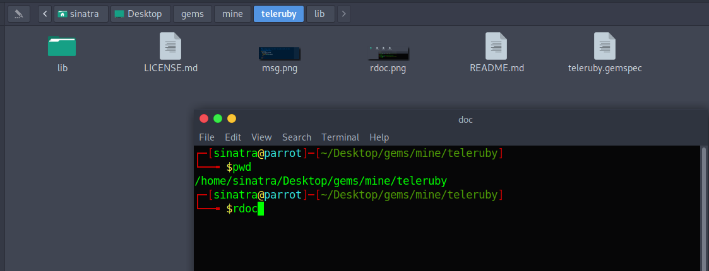

# Teleruby

 Is a lightweigth Ruby wrapper for Telegram bot.

## Installation

Add this line to your application's Gemfile:

```ruby
gem 'teleruby'
```

And then execute:

    $ bundle install

Or install it yourself as:

    $ sudo gem install teleruby

Obtain a bot token from [@botfather](https://t.me/botfather)

To test your bot's authentication token, use the *get_me* method.

```ruby
#!/usr/bin/ruby
# frozen_string_literal: true

require 'teleruby'

@token = %q{place-your-bot's-token-here}
@bot = Telegram::Client.new(token: @token)

me = @bot.get_me

puts 'first name:' + me.first_name
puts 'user name:' + me.username
puts 'id:' + me.id.to_s
```

# Usage

There are two ways to get update from Telegram Server.

 * polling
 * webhook

For now this library supports only polling method.

## Getting Update s

```ruby
#!/usr/bin/ruby
# frozen_string_literal: true

require 'teleruby'

@token = %q{place-your-bot's-token-here}
@bot = Telegram::Client.new(token: @token)

updates = @bot.get_updates
puts updates.inspect
```

+NB:+ The default number of updates to be retrieved is +10+, but you can add yours like.

```ruby
@bot = Telegram::Client.new(token: @token)

hash = {}
hash.limit = 10

update = -> { hash }
updates = @bot.get_updates update.call
```

Here 10 shows, 10 updates to be retrieved. Max limit is 100. You can also limit type of updates!.

```ruby
up_dates = ['message', 'channel_post']
hash = {}
hash.limit = 80

hash.allowed_updates = up_dates
update = -> { hash }

@bot = Telegram::Client.new(token: @token)
updates = @bot.get_updates update.call
```

In the above case bot will retrive 80 updates and only looks message and channel post notifications.

If you wanna create specific purpose bot, limiting type of request would be better!.

## Echo server

```ruby
#!/usr/bin/ruby
# frozen_string_literal: true

require 'teleruby'

@token = %q{place-your-bot's-token-here}
@bot = Telegram::Client.new(token: @token)

@bot.run! do
  updates = @bot.get_updates
  updates.each do |update|
    if update.msg?
      message = update.message
      chat = message.chat
      @bot.send_message(chat.id, message.text)
    end
  end
end

# echoes text message and replys to send message but
# you can make it to echo all send messages!
```

Telegram doesn't send left chat participant notification if your group members exceed 50.

*NB:* To use actions like pin_message, unpin_chat_message, promote_chat_member .... , your bot must have appropriate admin right in supergroup.

*Note:* Only get methods and send methods return object, the rest methods return hash object.

##### NB:
Sometimes optional methods return irrelevant, it may be nil or false, so you have to check it.

If Telegram response is irrelevant but expected to return Telegram object, then teleruby returns false and if it is expected to return other info rather than Telegram object, it returns nil.


###### Example:

```ruby
updates = @bot.get_updates
updates.eah do |update|
  if update.msg?
    # code goes here
  end
end
```

In the above case, message is optional, when? if ```bot(client)``` gets channel post notification and blah blah.

### Custom Keyboard

```ruby
question = 'which one is your favorite programming language?'

answer1 = 'Ruby'
answer2 = 'Python'
answer3 = 'Java'
answer4 = 'C'

hash1 = { text: answer1, callback_data: 'ruby' }
hash2 = { text: answer2, callback_data: 'python' }
hash3 = { text: answer3, callback_data: 'java' }
hash4 = { text: answer4, callback_data: 'c' }

button1 = [hash1]
button2 = [hash2]
button3 = [hash3]
button4 = [hash4]

ary_of_buttons = [button1, button2, button3, button4]

buttons = { inline_keyboard: ary_of_buttons }.to_json

msg = -> { { reply_markup: all_buttons } }
chat_id = 432234232 # provide target chat id
@bot.send_message(chat_id, question, msg.call)
```

### Inline Keyboard

```ruby
question = 'which one is your favorite programming language?'

answer1 = 'Ruby'
answer2 = 'Python'
answer3 = 'Java'
answer4 = 'C'

hash1 = { text: answer1, callback_data: 'ruby' }
hash2 = { text: answer2, callback_data: 'python' }
hash3 = { text: answer3, callback_data: 'java' }
hash4 = { text: answer4, callback_data: 'c' }

button1 = [hash1]
button2 = [hash2]
button3 = [hash3]
button4 = [hash4]

ary_of_buttons = [button1, button2, button3, button4]

buttons = { keyboard: ary_of_buttons }.to_json

msg = -> { { reply_markup: all_buttons, resize_keyboard: true, one_time_keyboard: true } }
chat_id = 432234232 # provide target chat id
@bot.send_message(chat_id, question, msg.call)
```

You can also make it like this...

```ruby
msg = { reply_markup: all_buttons, resize_keyboard: true, one_time_keyboard: true }
@bot.send_message(chat_id, question, msg)
```

May be confused with ```one_time_keyboard```?, well it makes keyboard to disappear after user clicks one button from the given choices.
To know about ```resize_keyboard```, remove it and send message, then see what you have got!

Check ```callback_query```, to see which button is clicked from the given one.

### Requesting Contact

```ruby
msg = 'please share your contact'
hash = { text: 'share', request_contact: true }

button = [hash]
buttons = [button]

msg  = { keyboard: buttons }.to_json
last = { reply_markup: msg, resize_keyboard: true, one_time_keyboard: true }
@bot.send_message(chat_id, msg, last)
```

You can also request +location+, and +request_poll+.

#### Send methods

* ```send_animation(chat_id, file_id, params)```
* ```send_audio(chat_id, file_id, params)```
* ```send_chat_action(chat_id, action)```
* ```send_contact(chat_id, phone_number, first_name, params)```
* ```send_document(chat_id, file_id, params)```
* ```send_dice(chat_id, params)```
* ```send_location+(chat_id, latitude, longitude, params)```
* ```send_media_group(chat_id, file_id, params)```
* ```send_message(chat_id+, text, params)```
* ```send_poll(chat_id, question, options, params)```
* ```send_voice(chat_id, file_id, params)```
* ```send_video(chat_id, file_id, params)```
* ```send_video_note(chat_id, file_id, params)```
* ```send_sticker(chat_id, file_id, params)```
* ```send_venue(chat_id, latitude, longitude, title, address, params)```

#### Delete methods

* ```delete_message(chat_id, message_id)```
* ```delete_chat_photo(chat_id)```
* ```delete_chat_sticker_set(chat_id)```
* ```delete_sticker_from_set(sticker```)

#### Set methods

* ```set_cutom_title(chat_id, user_id, title)```
* ```set_chat_permissions(chat_id, permissions)```
* ```set_chat_photo(chat_id, file)```
* ```set_chat_title(chat_id, title)```
* ```set_chat_sticker_set+(chat_id, set_name)```
* ```set_my_command(command)```
* ```set_sticker_position_in_the_set(sticker, position)```
* ```set_sticker_set_thumb(name, user_id, params)```
* ```set_chat_description(chat_id, description)```
 
#### Get Methods

* ```get_updates``
* ```get_me```
* ```get_file(file_id)```
* ```get_profile_photos(user_id, params)```
* ```get_chat_admins(chat_id)```
* ```get_members_count(chat_id)```
* ```get_chat_member(chat_id, user_id)```
* ```get_sticker_set_name(name)```
* ```get_chat(chat_id)```
* ```get_my_commands```

#### Other methods

* ```forward_message(from_chat_id, to_chat_id, message_id, params)```
* ```kick_chat_member(chat_id, user_id, params)```
* ```unban_chat_member(chat_id, user_id)```
* ```restrict_chat_member(chat_id, user_id, permissions, params)```
* ```promote_chat_member(chat_id, user_id, params)``
* ```export_chat_link(chat_id)```
* ```pin_chat_message(chat_id, message_id, params)```
* ```unpin_chat_message(chat_id)```
* ```leave_chat(chat_id)```
* ```stop_poll(chat_id, message_id, params)```
* ```upload_sticker_file(user_id, png_sticker)```
* ```create_new_stricker_set(user_id, name, title, params)```
* ```add_sticker_to_set(user_id, name, emojis, params)```

If you wanna know available methods:

```ruby
irb(main):002:0> require 'teleruby'
=> true
irb(main):004:0> bot = Telegram::Client.new(token: 'dafasfasfasfasf')
=> #<Telegram::Client:0x0000560aee01caa8 @token="dafasfasfasfasf", @last_update=0>
irb(main):005:0> bot.methods - self.methods
```

Lists all available methods.

#### Available Objects

Poll                 

Location

Venue
           
Chat

BotCommand           

ChatPermissions

ChatPhoto

CallbackQuery

TFile               

PollAnswer

PollOption         

Dice

Contact              

Voice

Video               

Audio

PhotoSize            

Document

VideoNote            

User

MessageEntity        

ChatMember

ChoseInlineResult    

Sticker

Game                 

InlineQuery

ShippingQuery        

MaskPosition

ShippingAddress      

PreCheckoutQuery

OrderInfo            

Message

Animation            

InlineKeyboardButton

InlineKeyboardMarkup 

UserProfilePhotos

Update

Please download the source file and do ```rdoc``` from the root of dir, then go to doc/, then open README_rdoc.html with your fav browser.



#### Discussion Group On Telegram
[hedase support](https://t.me/teleruby_support)

## Contributing

1. Fork it
2. Create your feature branch (git checkout -b my-new-feature)
3. Commit your changes (git commit -am 'Add some feature')
4. Push to the branch (git push origin my-new-feature)
5. Create new Pull Request

## License

The gem is available as open source under the terms of the [GPLv3+](https://gnu.org/licenses/gpl.html).

